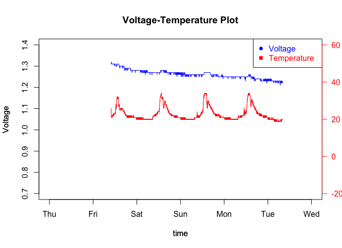

# plot_volt_temp_R
Plot **voltage-temperature** from an [Osan Pathfinder](https://www.osan.tech) SQLite database file

The script is useful when evaluating/estimating power consumption of various profile settings and battery chemistries.